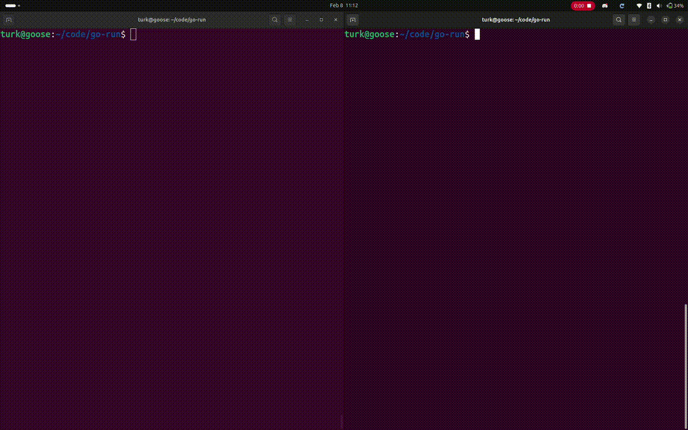

# go-run

`go-run` is a simple bash script that monitors for file change timestamps.

## Features
- accepts and passes arbitrary arguments
- lists detected file change
- stops upop program termination or signal interrupt
- preserves exit codes in all scenarios

## Getting Started
### bash
Copy the file and give it permission to run:
```sh
curl -O $URL $OUTPUT; chmod +x $OUTPUT # TODO make this real
```

Run the program anywhere you'd normally use `go run`, replacing `./go-run`:
```sh
go run ./example
```

> [!TIP]
> `go-run` is optimally kept in a `bin` directory, consolidated with other tools, so that it may be run as `go-run`

## Demo and Testing Options
Demo the project using the [example](./example/) module, as shown below:



## Why?

Code editor based live-reload tools work great for rendering plain `html`+`css`, but when Go templates must be rendered, the typical process of manually reloading is tedious.
