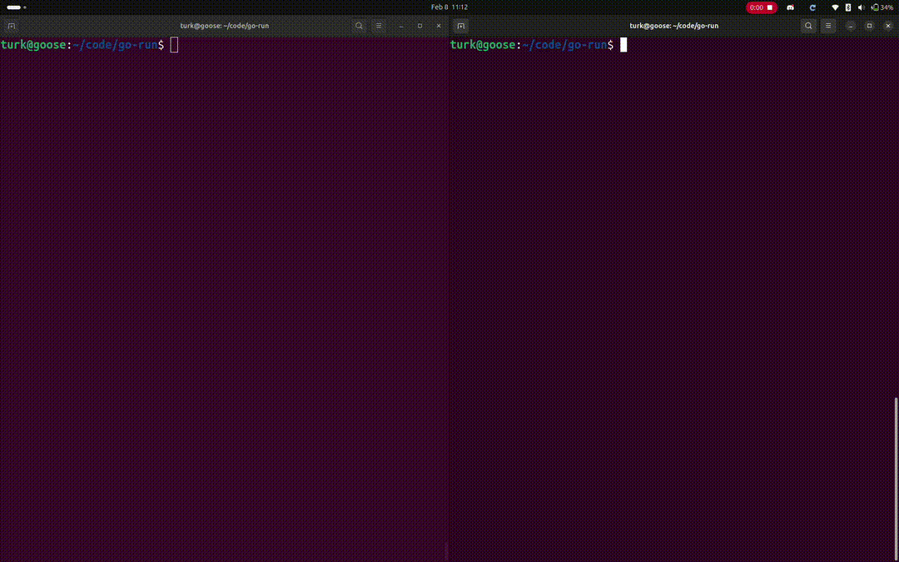
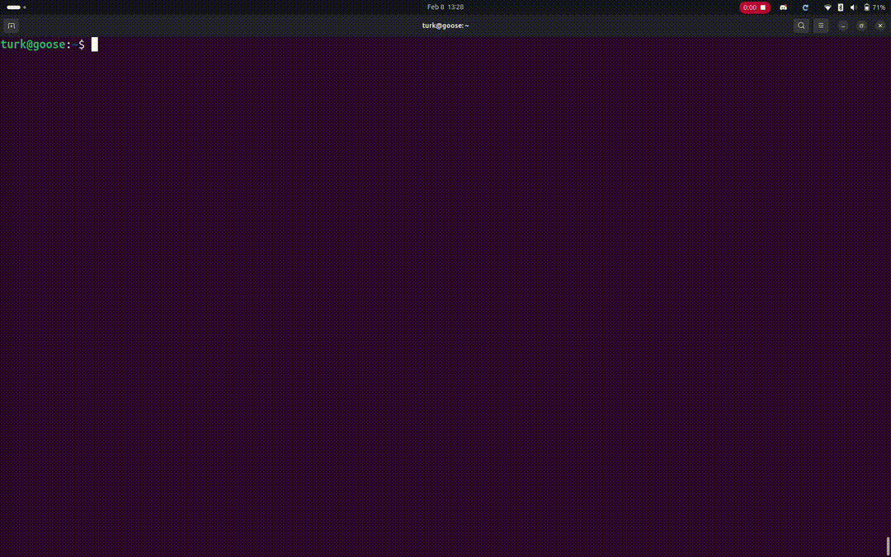

# go-run
`go-run` is a simple bash script that monitors for file change timestamps and reloads on changes.

While live-reload tools in the code editor work great for rendering plain `html`+`css`, Go projects utilizing templates require tedious manual reloading. `go-run` automates this.

[](https://github.com/grackleclub/go-run/actions/workflows/shellcheck.yml) [](https://github.com/grackleclub/go-run/actions/workflows/version.yml)

## Features
- accepts arbitrary arguments and passes them through
- lists detected file changes
- stops upon program termination or signal interrupt
- preserves exit codes in all scenarios

## Getting Started on Linux
Copy the file and give it permission to run:
```sh
curl -o go-run https://raw.githubusercontent.com/grackleclub/go-run/refs/heads/main/go-run
```

Make the script executable:
```sh
chmod +x go-run
```

Make the script globally executable (optional):
```sh
sudo mv go-run /usr/local/bin
```

> [!TIP]
> `go-run` can be scoped to the project, and optimally kept in a `bin` directory, consolidated with other tools, so that it may be run as `bin/go-run`. Use the optional step of moving the script to `/usr/local/bin` to make `go-run` directly executable from anywhere.

## Demo and Testing Options
Demo the project using the [example](./example/) module:


## Updating
Run `go-run update` to update:


## Feedback
😎 Open a [pull request](https://github.com/grackleclub/go-run/pulls)!
