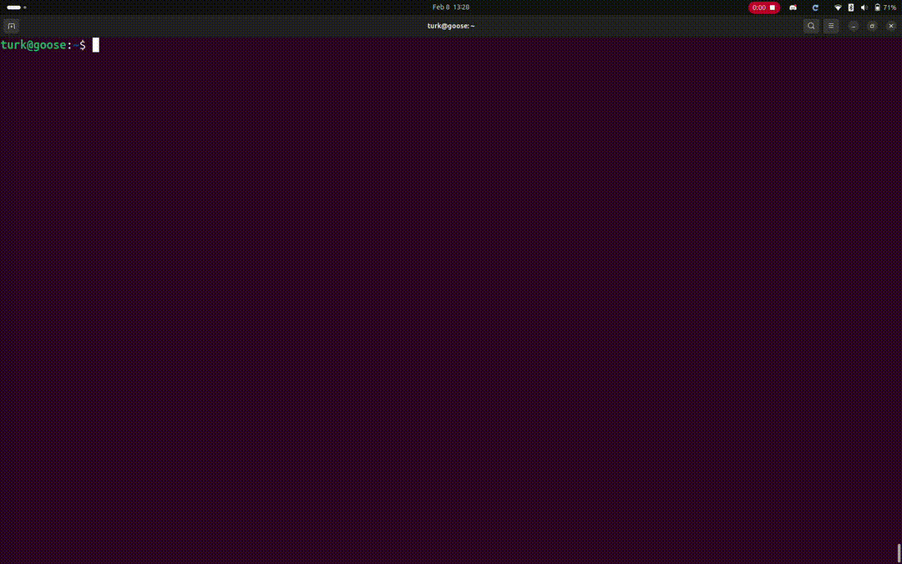
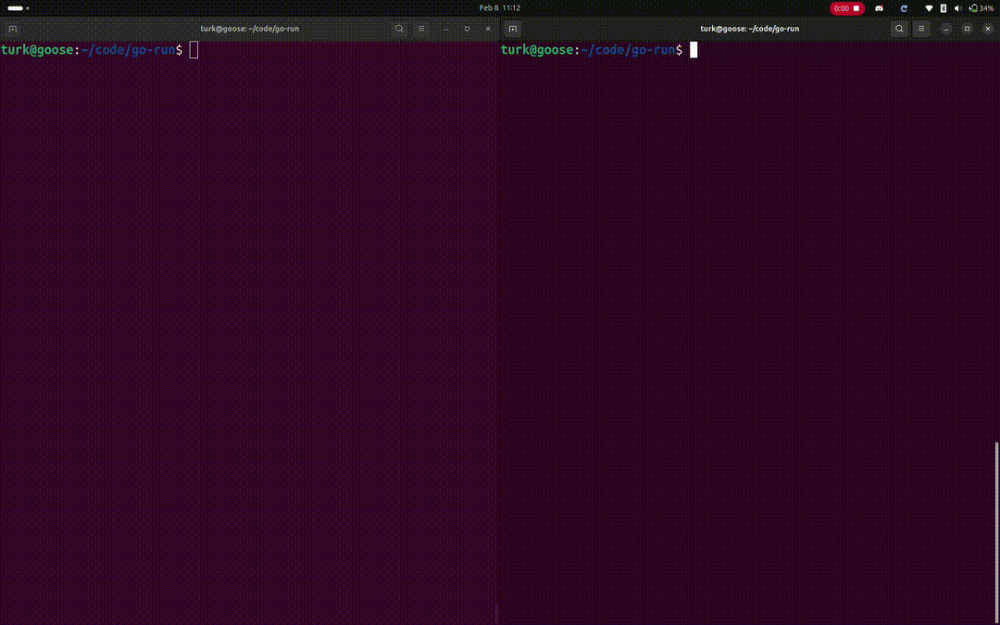

# go-run
`go-run` is a simple bash script that monitors for file change and reloads automatically.

While live-reload tools in the code editor work great for rendering plain `html`+`css`, Go projects utilizing templates require tedious manual reloading. `go-run` automates this.

[](https://github.com/grackleclub/go-run/actions/workflows/shellcheck.yml) [](https://github.com/grackleclub/go-run/actions/workflows/release.yml)

## features
- live reload of go server when relevant files have changed
- accepts arbitrary arguments and passes them through
- lists detected file changes
- stops upon program termination or signal interrupt
- preserves exit codes in all scenarios
- builds outside the working tree, leaving no artifact behind

## getting started

### `mise` (recommended)
[mise](https://mise.jdx.dev) can manage installation and invoke `go-run` in the appropriate development contexts (using `mise task`/`mise run`).


#### setup
```toml
[tools]
go = "1.25"
sqlc = "latest"
"github:grackleclub/go-run" = "latest"

[tasks.sqlc]
description = "generate query code"
dir = "db"
run = "sqlc generate"

[tasks.dev]
description = "start dev server with db; reload on file changes"
depends = ["sqlc"]
run = "go-run ./cmd/cli -v"
```

#### usage

Installation:
```sh
mise install
```

Invocation:
```sh
mise run dev
```

`mise run dev` now regenerates, builds, serves, and restarts on every save.
Arguments after the target directory reach your program, so
`go-run . --verbose` is the task equivalent of `go run . --verbose`.

> [!NOTE]
> .gitignored files are also ignored by `go-run`; all other files will trigger a rebuild.

### direct
Copy the file and give it permission to run:
```sh
curl -o go-run https://raw.githubusercontent.com/grackleclub/go-run/refs/heads/main/go-run
```

Make the script executable:
```sh
chmod +x go-run
```

Make the script globally executable (optional):
```sh
sudo mv go-run /usr/local/bin
```

Verify installation:
```sh
go-run version
```

Update:
```sh
go-run update
```


## demo & testing
Demo the project using the [example](./example/) module:


## feedback
😎 Open a [pull request](https://github.com/grackleclub/go-run/pulls)!
